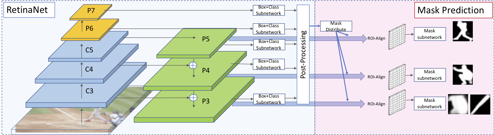

# Faster R-CNN and Mask R-CNN in PyTorch 1.0

**maskrcnn-benchmark has been deprecated. Please see [detectron2](https://github.com/facebookresearch/detectron2), which includes implementations for all models in maskrcnn-benchmark**

This project aims at providing the necessary building blocks for easily
creating detection and segmentation models using PyTorch 1.0.


## Highlights
- **PyTorch 1.0:** RPN, Faster R-CNN and Mask R-CNN implementations that matches or exceeds Detectron accuracies
- **Very fast**: up to **2x** faster than [Detectron](https://github.com/facebookresearch/Detectron) and **30%** faster than [mmdetection](https://github.com/open-mmlab/mmdetection) during training. See [MODEL_ZOO.md](MODEL_ZOO.md) for more details.
- **Memory efficient:** uses roughly 500MB less GPU memory than mmdetection during training
- **Multi-GPU training and inference**
- **Mixed precision training:** trains faster with less GPU memory on [NVIDIA tensor cores](https://developer.nvidia.com/tensor-cores).
- **Batched inference:** can perform inference using multiple images per batch per GPU
- **CPU support for inference:** runs on CPU in inference time. See our [webcam demo](demo) for an example
- Provides pre-trained models for almost all reference Mask R-CNN and Faster R-CNN configurations with 1x schedule.

## Webcam and Jupyter notebook demo

We provide a simple webcam demo that illustrates how you can use `maskrcnn_benchmark` for inference:
```bash
cd demo
# by default, it runs on the GPU
# for best results, use min-image-size 800
python webcam.py --min-image-size 800
# can also run it on the CPU
python webcam.py --min-image-size 300 MODEL.DEVICE cpu
# or change the model that you want to use
python webcam.py --config-file ../configs/caffe2/e2e_mask_rcnn_R_101_FPN_1x_caffe2.yaml --min-image-size 300 MODEL.DEVICE cpu
# in order to see the probability heatmaps, pass --show-mask-heatmaps
python webcam.py --min-image-size 300 --show-mask-heatmaps MODEL.DEVICE cpu
# for the keypoint demo
python webcam.py --config-file ../configs/caffe2/e2e_keypoint_rcnn_R_50_FPN_1x_caffe2.yaml --min-image-size 300 MODEL.DEVICE cpu
```

A notebook with the demo can be found in [demo/Mask_R-CNN_demo.ipynb](demo/Mask_R-CNN_demo.ipynb).

# RetinaMask


The code is based on the [maskrcnn-benchmark](https://github.com/facebookresearch/maskrcnn-benchmark).




### Citing RetinaMask
Please cite RetinaMask in your publications if it helps your research:

    @inproceedings{fu2019retinamask,
      title = {{RetinaMask}: Learning to predict masks improves state-of-the-art single-shot detection for free},
      author = {Fu, Cheng-Yang and  Shvets, Mykhailo and Berg, Alexander C.},
      booktitle = {arXiv preprint arXiv:1901.03353},
      year = {2019}
    }


### Contents
1. [Installation](#installation)
2. [Models](#models)

### Installation 
Follow the [maskrcnn-benchmark](./OLD_README.md) to install code and set up the dataset. Use config files in ./configs/retina/ for Training and Testing.


### Models

| Models         | BBox          | B(time)   | Mask  | M(time)    | Link |
| -------------- | ------------- | ---| ----- | --- | ---- |
| ResNet-50-FPN  | 39.4/58.6/42.3/21.9/42.0/51.0 | 0.124 | 34.9/55.7/37.1/15.1/36.7/50.4 | 0.139 | [link](https://drive.google.com/file/d/17QnkNoibgzRnnSeLDFo27LmgPUifFBxz/view?usp=sharing) |
| ResNet-101-FPN | 41.4/ 60.8/44.6/23.0/44.5/53.5 | 0.145 | 36.6/58.0/39.1/16.2/38.8/52.7 | 0.160 | [link](https://drive.google.com/file/d/1Fl-TI1oDRVBFYI1h1mn7IiEOXwTIR3AC/view?usp=sharing) |
| ResNet-101-FPN-GN | 41.7/61.7/45.0/23.5/44.7/52.8 | 0.153 | 36.7/58.8/39.3/16.4/39.4/52.6 | 0.164 | [link](https://drive.google.com/file/d/19MCU9Q0YXbIrc4fRSPRV53T_RSxiVqh0/view?usp=sharing) | 
| ResNeXt32x8d-101-FPN-GN  | 42.6/62.5/46.0/24.8/45.6/53.8 | 0.231 | 37.4/59.8/40.0/17.6/39.9/53.4 | 0.270 | [link](https://drive.google.com/file/d/1n-tcTUZ28s0uvDOB_gZmsFtxA8flGxKF/view?usp=sharing) |

P.S. evaluation metric: AP, AP50, AP75, AP(small), AP(medium), AP(large), please refer to [COCO](http://cocodataset.org/#detection-eval) for detailed explanation. The inference time is measured on Nvidia 1080Ti.

```bash
# symlink the coco dataset
cd ~/github/maskrcnn-benchmark
mkdir -p datasets/coco
ln -s /path_to_coco_dataset/annotations datasets/coco/annotations
ln -s /path_to_coco_dataset/train2014 datasets/coco/train2014
ln -s /path_to_coco_dataset/test2014 datasets/coco/test2014
ln -s /path_to_coco_dataset/val2014 datasets/coco/val2014
# or use COCO 2017 version
ln -s /path_to_coco_dataset/annotations datasets/coco/annotations
ln -s /path_to_coco_dataset/train2017 datasets/coco/train2017
ln -s /path_to_coco_dataset/test2017 datasets/coco/test2017
ln -s /path_to_coco_dataset/val2017 datasets/coco/val2017

# for pascal voc dataset:
ln -s /path_to_VOCdevkit_dir datasets/voc
```

#### Run Inference
Use the following scripts. (Assume models are download to the ./models directory)
Run Mask and BBox

```bash
python tools/test_net.py --config-file ./configs/retina/retinanet_mask_R-50-FPN_2x_adjust_std011_ms.yaml MODEL.WEIGHT ./models/retinanet_mask_R-50-FPN_2x_adjust_std011_ms_model.pth
```

P.S. `COCO_2017_train` = `COCO_2014_train` + `valminusminival` , `COCO_2017_val` = `minival`
      

You can also configure your own paths to the datasets.
For that, all you need to do is to modify `maskrcnn_benchmark/config/paths_catalog.py` to
point to the location where your dataset is stored.
You can also create a new `paths_catalog.py` file which implements the same two classes,
and pass it as a config argument `PATHS_CATALOG` during training.

### Single GPU training

Most of the configuration files that we provide assume that we are running on 8 GPUs.
In order to be able to run it on fewer GPUs, there are a few possibilities:

**1. Run the following without modifications**

```bash
python /path_to_maskrcnn_benchmark/tools/train_net.py --config-file "/path/to/config/file.yaml"
```
This should work out of the box and is very similar to what we should do for multi-GPU training.
But the drawback is that it will use much more GPU memory. The reason is that we set in the
configuration files a global batch size that is divided over the number of GPUs. So if we only
have a single GPU, this means that the batch size for that GPU will be 8x larger, which might lead
to out-of-memory errors.

If you have a lot of memory available, this is the easiest solution.

**2. Modify the cfg parameters**

If you experience out-of-memory errors, you can reduce the global batch size. But this means that
you'll also need to change the learning rate, the number of iterations and the learning rate schedule.

Here is an example for Mask R-CNN R-50 FPN with the 1x schedule:
```bash
python tools/train_net.py --config-file "configs/e2e_mask_rcnn_R_50_FPN_1x.yaml" SOLVER.IMS_PER_BATCH 2 SOLVER.BASE_LR 0.0025 SOLVER.MAX_ITER 720000 SOLVER.STEPS "(480000, 640000)" TEST.IMS_PER_BATCH 1 MODEL.RPN.FPN_POST_NMS_TOP_N_TRAIN 2000
```
Run BBox only

```bash
python tools/test_net.py --config-file ./configs/retina/retinanet_mask_R-50-FPN_2x_adjust_std011_ms.yaml MODEL.WEIGHT ./models/retinanet_mask_R-50-FPN_2x_adjust_std011_ms_model.pth MODEL.MASK_ON False
```

We also changed the batch size during testing, but that is generally not necessary because testing
requires much less memory than training.

Furthermore, we set `MODEL.RPN.FPN_POST_NMS_TOP_N_TRAIN 2000` as the proposals are selected for per the batch rather than per image in the default training. The value is calculated by **1000 x images-per-gpu**. Here we have 2 images per GPU, therefore we set the number as 1000 x 2 = 2000. If we have 8 images per GPU, the value should be set as 8000. Note that this does not apply if `MODEL.RPN.FPN_POST_NMS_PER_BATCH` is set to `False` during training. See [#672](https://github.com/facebookresearch/maskrcnn-benchmark/issues/672) for more details.

### Multi-GPU training
We use internally `torch.distributed.launch` in order to launch
multi-gpu training. This utility function from PyTorch spawns as many
Python processes as the number of GPUs we want to use, and each Python
process will only use a single GPU.

```bash
export NGPUS=8
python -m torch.distributed.launch --nproc_per_node=$NGPUS /path_to_maskrcnn_benchmark/tools/train_net.py --config-file "path/to/config/file.yaml" MODEL.RPN.FPN_POST_NMS_TOP_N_TRAIN images_per_gpu x 1000
```
Note we should set `MODEL.RPN.FPN_POST_NMS_TOP_N_TRAIN` follow the rule in Single-GPU training.

### Mixed precision training
We currently use [APEX](https://github.com/NVIDIA/apex) to add [Automatic Mixed Precision](https://developer.nvidia.com/automatic-mixed-precision) support. To enable, just do Single-GPU or Multi-GPU training and set `DTYPE "float16"`.

```bash
export NGPUS=8
python -m torch.distributed.launch --nproc_per_node=$NGPUS /path_to_maskrcnn_benchmark/tools/train_net.py --config-file "path/to/config/file.yaml" MODEL.RPN.FPN_POST_NMS_TOP_N_TRAIN images_per_gpu x 1000 DTYPE "float16"
```
If you want more verbose logging, set `AMP_VERBOSE True`. See [Mixed Precision Training guide](https://docs.nvidia.com/deeplearning/sdk/mixed-precision-training/index.html) for more details.

## Evaluation
You can test your model directly on single or multiple gpus. Here is an example for Mask R-CNN R-50 FPN with the 1x schedule on 8 GPUS:
```bash
export NGPUS=8
python -m torch.distributed.launch --nproc_per_node=$NGPUS /path_to_maskrcnn_benchmark/tools/test_net.py --config-file "configs/e2e_mask_rcnn_R_50_FPN_1x.yaml" TEST.IMS_PER_BATCH 16
```
To calculate mAP for each class, you can simply modify a few lines in [coco_eval.py](https://github.com/facebookresearch/maskrcnn-benchmark/blob/master/maskrcnn_benchmark/data/datasets/evaluation/coco/coco_eval.py). See [#524](https://github.com/facebookresearch/maskrcnn-benchmark/issues/524#issuecomment-475118810) for more details.

## Abstractions
For more information on some of the main abstractions in our implementation, see [ABSTRACTIONS.md](ABSTRACTIONS.md).

## Adding your own dataset

This implementation adds support for COCO-style datasets.
But adding support for training on a new dataset can be done as follows:
```python
from maskrcnn_benchmark.structures.bounding_box import BoxList

class MyDataset(object):
    def __init__(self, ...):
        # as you would do normally

    def __getitem__(self, idx):
        # load the image as a PIL Image
        image = ...

        # load the bounding boxes as a list of list of boxes
        # in this case, for illustrative purposes, we use
        # x1, y1, x2, y2 order.
        boxes = [[0, 0, 10, 10], [10, 20, 50, 50]]
        # and labels
        labels = torch.tensor([10, 20])

        # create a BoxList from the boxes
        boxlist = BoxList(boxes, image.size, mode="xyxy")
        # add the labels to the boxlist
        boxlist.add_field("labels", labels)

        if self.transforms:
            image, boxlist = self.transforms(image, boxlist)

        # return the image, the boxlist and the idx in your dataset
        return image, boxlist, idx

    def get_img_info(self, idx):
        # get img_height and img_width. This is used if
        # we want to split the batches according to the aspect ratio
        # of the image, as it can be more efficient than loading the
        # image from disk
        return {"height": img_height, "width": img_width}
```
That's it. You can also add extra fields to the boxlist, such as segmentation masks
(using `structures.segmentation_mask.SegmentationMask`), or even your own instance type.

For a full example of how the `COCODataset` is implemented, check [`maskrcnn_benchmark/data/datasets/coco.py`](maskrcnn_benchmark/data/datasets/coco.py).

Once you have created your dataset, it needs to be added in a couple of places:
- [`maskrcnn_benchmark/data/datasets/__init__.py`](maskrcnn_benchmark/data/datasets/__init__.py): add it to `__all__`
- [`maskrcnn_benchmark/config/paths_catalog.py`](maskrcnn_benchmark/config/paths_catalog.py): `DatasetCatalog.DATASETS` and corresponding `if` clause in `DatasetCatalog.get()`

### Testing
While the aforementioned example should work for training, we leverage the
cocoApi for computing the accuracies during testing. Thus, test datasets
should currently follow the cocoApi for now.

To enable your dataset for testing, add a corresponding if statement in [`maskrcnn_benchmark/data/datasets/evaluation/__init__.py`](maskrcnn_benchmark/data/datasets/evaluation/__init__.py):
```python
if isinstance(dataset, datasets.MyDataset):
        return coco_evaluation(**args)
```

## Finetuning from Detectron weights on custom datasets
Create a script `tools/trim_detectron_model.py` like [here](https://gist.github.com/wangg12/aea194aa6ab6a4de088f14ee193fd968).
You can decide which keys to be removed and which keys to be kept by modifying the script.

Then you can simply point the converted model path in the config file by changing `MODEL.WEIGHT`.

For further information, please refer to [#15](https://github.com/facebookresearch/maskrcnn-benchmark/issues/15).

## Troubleshooting
If you have issues running or compiling this code, we have compiled a list of common issues in
[TROUBLESHOOTING.md](TROUBLESHOOTING.md). If your issue is not present there, please feel
free to open a new issue.

## Citations
Please consider citing this project in your publications if it helps your research. The following is a BibTeX reference. The BibTeX entry requires the `url` LaTeX package.
```
@misc{massa2018mrcnn,
author = {Massa, Francisco and Girshick, Ross},
title = {{maskrcnn-benchmark: Fast, modular reference implementation of Instance Segmentation and Object Detection algorithms in PyTorch}},
year = {2018},
howpublished = {\url{https://github.com/facebookresearch/maskrcnn-benchmark}},
note = {Accessed: [Insert date here]}
}
```

## Projects using maskrcnn-benchmark

- [RetinaMask: Learning to predict masks improves state-of-the-art single-shot detection for free](https://arxiv.org/abs/1901.03353). 
  Cheng-Yang Fu, Mykhailo Shvets, and Alexander C. Berg.
  Tech report, arXiv,1901.03353.
- [FCOS: Fully Convolutional One-Stage Object Detection](https://arxiv.org/abs/1904.01355).
  Zhi Tian, Chunhua Shen, Hao Chen and Tong He.
  Tech report, arXiv,1904.01355. [[code](https://github.com/tianzhi0549/FCOS)]
- [MULAN: Multitask Universal Lesion Analysis Network for Joint Lesion Detection, Tagging, and Segmentation](https://arxiv.org/abs/1908.04373).
  Ke Yan, Youbao Tang, Yifan Peng, Veit Sandfort, Mohammadhadi Bagheri, Zhiyong Lu, and Ronald M. Summers.
  MICCAI 2019. [[code](https://github.com/rsummers11/CADLab/tree/master/MULAN_universal_lesion_analysis)]
- [Is Sampling Heuristics Necessary in Training Deep Object Detectors?](https://arxiv.org/abs/1909.04868)
  Joya Chen, Dong Liu, Tong Xu, Shilong Zhang, Shiwei Wu, Bin Luo, Xuezheng Peng, Enhong Chen.
  Tech report, arXiv,1909.04868. [[code](https://github.com/ChenJoya/sampling-free)]
  
## License

maskrcnn-benchmark is released under the MIT license. See [LICENSE](LICENSE) for additional details.
